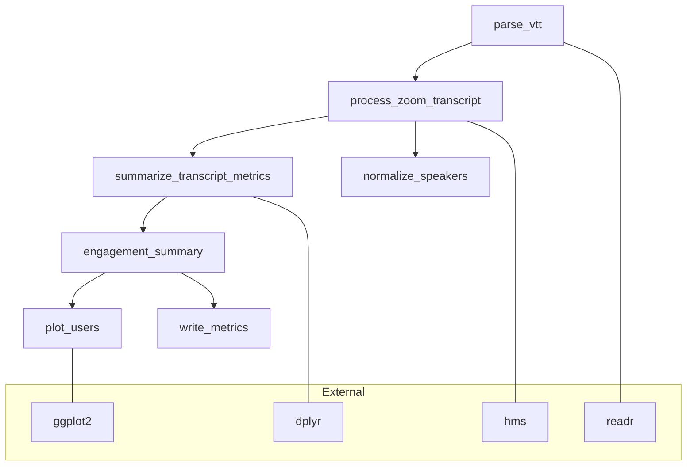

# Project Profile and CRAN Week Plan

## 1) Executive Summary
Zoom Student Engagement (`zoomstudentengagement`) converts Zoom `.vtt` transcripts and course rosters into privacy-aware engagement metrics and visualizations, supporting instructors in evaluating participation equity.

The package is functionally rich but has a broad public surface (80+ exports), complex dependencies, and heavy test fixtures. Missing R environment blocked test execution here, highlighting portability risk. Documentation and CI are mature, yet API scope and dependency minimization remain top concerns. Segfault history indicates platform sensitivity.

**Target (7 days):** deliver a CRAN-ready v1.0.1 under the final name `engager`, with clean R CMD check, trimmed examples, NEWS/README updates, and dependency sanity.

## 2) CRAN-Week Triage
### MUST-DO (Blocking)
- Ensure `devtools::check()` passes without Notes.
- Audit examples for execution time <5s; move lengthy ones to `dontrun`.
- Verify dependencies in DESCRIPTION; drop unused suggests/imports.
- Confirm LICENSE stub + `LICENSE.md` alignment and update NEWS/README.
- Run `scripts/pre-pr-validation.R` before submission.
- Decide on and implement pre-CRAN rename to `engager` to avoid future CRAN resubmission.

### SHOULD-DO
- Polish documentation (roxygen examples, vignette links).
- Stage pkgdown site and verify navigation.
- Fill small test gaps for parsing edge cases.

### DEFER (Post-CRAN)
- Deeper API reshaping that changes user surface.
- Noncritical refactors or performance overhauls.

## 3) Repository Snapshot
### DESCRIPTION
- Package: zoomstudentengagement | Version: 1.0.0 | Title: Zoom Student Engagement | License: MIT + file LICENSE | Imports: digest, dplyr, ggplot2, hms, jsonlite, lubridate, magrittr, openxlsx, readr, rlang, stringr, tibble | Suggests: testthat, withr, covr, knitr, rmarkdown, purrr, microbenchmark, pryr【F:DESCRIPTION†L1-L32】

### Directory Map
- `R/`, `man/`, `tests/`, `vignettes/`, `inst/`, `docs/`, `scripts/`, `.github/`

### CI Status
- GitHub Actions workflows present: R-CMD-check, coverage, lint, pkgdown, etc., using r-lib/actions【F:.github/workflows/R-CMD-check.yaml†L1-L49】
- README shows coverage badge only; build status badges can be added【F:README.md†L45-L46】

## 4) Function Inventory
| function_name | file | purpose | exported? | key deps | tests | notes |
|---|---|---|---|---|---|---|
| `load_zoom_transcript` | R/load_zoom_transcript.R | Parse single `.vtt` into tibble | yes | readr, hms | yes (test-load_zoom_transcript.R) | validates VTT header【F:R/load_zoom_transcript.R†L36-L44】 |
| `process_zoom_transcript` | R/process_zoom_transcript.R | Consolidate comments, add dead air | yes | hms, tibble | yes | heavy base-R logic to avoid segfaults【F:R/process_zoom_transcript.R†L47-L108】 |
| `summarize_transcript_metrics` | R/summarize_transcript_metrics.R | Compute engagement metrics for one transcript | yes | dplyr, tibble | yes | uses provenance attrs |
| `summarize_transcript_files` | R/summarize_transcript_files.R | Batch metrics over multiple files | yes | dplyr, readr | yes | deduplicate option |
| `analyze_transcripts` | R/analyze_transcripts.R | High-level folder→metrics wrapper | yes | tibble | yes | writes via `write_metrics`【F:R/analyze_transcripts.R†L12-L42】 |
| `plot_users` | R/plot_users.R | Bar chart of metrics | yes | ggplot2 | yes | replaces older plot APIs |
| `write_metrics` | R/write_metrics.R | Output metrics to CSV | yes | readr | yes | unified writer |
| `mask_user_names_by_metric` | R/mask_user_names_by_metric.R | Privacy masking of metrics | yes | dplyr | yes | supports section masks |
| `privacy_audit` | R/privacy_audit.R | Summarize masking coverage | yes | dplyr | yes | helper for compliance |
| `safe_name_matching_workflow` | R/safe_name_matching_workflow.R | Interactive name matching flow | yes | dplyr, stringr | yes | consider making internal |
| `load_roster` | R/load_roster.R | Import course roster | yes | readr | yes | schema validation |
| `load_session_mapping` | R/load_session_mapping.R | Map recordings to sessions | yes | readr | yes | timezone parsing risk |
| `join_transcripts_list` | R/join_transcripts_list.R | Combine multiple transcripts | yes | dplyr | yes | provides base for metrics |
| `plot_users_by_metric` | R/plot_users_by_metric.R | Legacy plotting | yes | ggplot2 | yes | soft-deprecated to `plot_users` |
| `write_engagement_metrics` | R/write_engagement_metrics.R | Legacy writer | yes | readr | yes | delegates to `write_metrics` |

**Proposed Minimal Public API for CRAN**
- Parse/IO: `parse_vtt()`, `parse_vtt_dir()`, `normalize_speakers()`
- Metrics: `engagement_summary()`, `speaking_time()`, `turn_counts()`, `silence_gaps()`, `overlap_ratio()`, `q_response_lag()`
- Viz: `plot_speaker_timeline()`, `plot_participation_hist()`, `plot_interaction_network()`

**Functions to Internalize**
- `add_dead_air_rows`, `consolidate_transcript`, `mask_user_names_by_metric`, `prompt_name_matching`, `write_engagement_metrics`, `plot_users_by_metric`, `plot_users_masked_section_by_metric`, diagnostic helpers (`diag_cat`, `diag_message`).

## 5) Mermaid Function Map

## 6) Best-Practices Gap Analysis
- **R organization**: One large `R/` directory; consider submodules post-CRAN.
- **Roxygen/NAMESPACE**: docs present but 80+ exports expand surface; reduce exports.
- **Imports vs Suggests**: ensure each import used; e.g., openxlsx disabled in NEWS but still imported【F:DESCRIPTION†L16-L25】.
- **Error handling**: central helper `abort_zse` standardizes classes【F:R/errors.R†L1-L17】; ensure all parsing functions use it.
- **Input validation**: `load_zoom_transcript` checks VTT header【F:R/load_zoom_transcript.R†L36-L44】; similar guards needed across loaders.
- **Tests**: Comprehensive testthat 3e suite (`tests/testthat/`); ensure fixtures anonymized.
- **Lint/style**: `.lintr` enforces 100-char lines and snake_case【F:.lintr†L1-L1】; run `styler::style_pkg()` routinely.
- **Docs**: README includes quick start and coverage badge【F:README.md†L49-L55】; vignettes cover FERPA, session mapping, plotting.
- **Performance**: some loops in `load_zoom_transcript` could be vectorized【F:R/load_zoom_transcript.R†L78-L85】.
- **Release**: NEWS.md tracks releases; ensure cran-comments.md prepared.
- **Compliance**: No real data in repo; maintain synthetic examples.

## 7) Target Architecture & Ideal Organization
- **Submodules**: `R/parsing/`, `R/metrics/`, `R/viz/`, `R/utils/` to improve cohesion.
- **Naming**: concise verbs (`parse_*`, `summarize_*`, `plot_*`).
- **Dependencies**: keep core to dplyr, readr, ggplot2, hms; move heavy or rarely used packages to Suggests.
- **Export policy**: expose only workflow-level functions; keep helpers internal.

## 8) Action Plan
### 7-Day CRAN Checklist
| Task | Owner | Acceptance | Risk |
|---|---|---|---|
| Run `devtools::check()` and fix notes | TBD | 0 errors/warnings/notes | medium (platform)
| Trim examples & add `dontrun` where needed | TBD | Examples <5s | low
| Audit dependencies & update DESCRIPTION | TBD | No unused imports | medium
| Update NEWS.md/README.md for 1.0.1 | TBD | Docs match release | low
| Pre-PR validation script | TBD | Script passes | high (env setup)
| Rename package to `engager` | TBD | All package references updated | medium (coordination)

### 30/60/90 Roadmap
- **30 days**: finalize parsing refactor, internalize helper exports, launch pkgdown.
- **60 days**: metric API hardening, add property-based tests, expand visualization suite.
- **90 days**: architecture reorganization, CI caching tweaks, performance profiling.

### Stop-Doing / Avoid
- Avoid adding new dependencies pre-CRAN.
- No major refactors or API breaks before submission.
- Skip long-running examples in CRAN docs.

## 9) Rename Plan: `zoomstudentengagement` → `engager`
**Recommendation:** Rename **before** CRAN submission to keep a single package identity and avoid the overhead of orphaning and resubmitting under a new name.

1. Update `DESCRIPTION` Package field and references.
2. Replace mentions in docs, vignettes, README.
3. Regenerate roxygen and NAMESPACE.
4. Adjust pkgdown config and site URL.
5. Rename GitHub repo and set redirects.
6. Submit `engager` to CRAN.

*Tradeoffs*: Pre-CRAN rename requires coordinated changes and may delay submission; post-CRAN rename would necessitate package removal and resubmission, confusing users and breaking links.

## 10) Appendix
- **Labels**: `cran-week`, `refactor`, `api`, `compliance`, `documentation`.
- **Issue templates**: bug, feature, compliance review, CRAN-prep.
- **Snippets**:
  - `.lintr` as above; add `lintr::lint_package()` CI step.
  - `Rscript -e "styler::style_pkg()"` for formatting.
  - r-lib/actions YAML already present for R-CMD-check, coverage, pkgdown.
- **usethis helpers**:
  - `usethis::use_vignette("getting-started")`
  - `usethis::use_test("parse_vtt")`
  - `usethis::use_pkgdown()`

