# Function Dependencies Diagram for zoomstudentengagement Package

This diagram shows all exported functions and their dependencies on internal functions in the zoomstudentengagement R package.

```mermaid
graph TD
    %% Core Processing Functions
    analyze_transcripts["analyze_transcripts<br/>(exported)"] --> summarize_transcript_files["summarize_transcript_files<br/>(exported)"]
    analyze_transcripts --> write_metrics["write_metrics<br/>(exported)"]
    
    summarize_transcript_files --> detect_duplicate_transcripts["detect_duplicate_transcripts<br/>(exported)"]
    summarize_transcript_files --> summarize_transcript_metrics["summarize_transcript_metrics<br/>(exported)"]
    summarize_transcript_files --> handle_duplicate_detection["handle_duplicate_detection<br/>(internal)"]
    summarize_transcript_files --> extract_original_metadata["extract_original_metadata<br/>(internal)"]
    summarize_transcript_files --> process_transcript_files["process_transcript_files<br/>(internal)"]
    summarize_transcript_files --> process_and_return_results["process_and_return_results<br/>(internal)"]
    
    summarize_transcript_metrics --> process_zoom_transcript["process_zoom_transcript<br/>(exported)"]
    summarize_transcript_metrics --> ensure_privacy["ensure_privacy<br/>(exported)"]
    
    process_zoom_transcript --> load_zoom_transcript["load_zoom_transcript<br/>(exported)"]
    process_zoom_transcript --> consolidate_transcript["consolidate_transcript<br/>(exported)"]
    process_zoom_transcript --> add_dead_air_rows["add_dead_air_rows<br/>(exported)"]
    
    load_zoom_transcript --> abort_zse["abort_zse<br/>(internal)"]
    load_zoom_transcript --> validate_schema["validate_schema<br/>(exported)"]
    
    consolidate_transcript --> create_empty_result["create_empty_result<br/>(internal)"]
    consolidate_transcript --> process_transcript_timing["process_transcript_timing<br/>(internal)"]
    consolidate_transcript --> aggregate_transcript_data["aggregate_transcript_data<br/>(internal)"]
    consolidate_transcript --> calculate_final_metrics["calculate_final_metrics<br/>(internal)"]
    consolidate_transcript --> perform_aggregation["perform_aggregation<br/>(internal)"]
    
    add_dead_air_rows --> warning["warning<br/>(base R)"]
    
    %% Duplicate Detection
    detect_duplicate_transcripts --> validate_duplicate_inputs["validate_duplicate_inputs<br/>(exported)"]
    detect_duplicate_transcripts --> create_empty_duplicate_result["create_empty_duplicate_result<br/>(internal)"]
    detect_duplicate_transcripts --> calculate_metadata_similarity["calculate_metadata_similarity<br/>(internal)"]
    detect_duplicate_transcripts --> calc_content_similarity_matrix["calc_content_similarity_matrix<br/>(internal)"]
    detect_duplicate_transcripts --> find_duplicate_groups["find_duplicate_groups<br/>(internal)"]
    detect_duplicate_transcripts --> calculate_content_similarity["calculate_content_similarity<br/>(exported)"]
    
    calc_content_similarity_matrix --> load_zoom_transcript
    calc_content_similarity_matrix --> calculate_content_similarity
    
    %% Privacy and Compliance
    ensure_privacy --> validate_privacy_level["validate_privacy_level<br/>(internal)"]
    ensure_privacy --> handle_privacy_level["handle_privacy_level<br/>(internal)"]
    ensure_privacy --> apply_privacy_masking["apply_privacy_masking<br/>(internal)"]
    ensure_privacy --> log_privacy_operation["log_privacy_operation<br/>(internal)"]
    
    write_metrics --> process_data_for_export["process_data_for_export<br/>(internal)"]
    write_metrics --> write_processed_data_to_file["write_processed_data_to_file<br/>(internal)"]
    write_metrics --> ensure_privacy
    
    process_data_for_export --> ensure_privacy
    
    validate_privacy_compliance["validate_privacy_compliance<br/>(exported)"] --> extract_character_values["extract_character_values<br/>(internal)"]
    validate_privacy_compliance --> detect_privacy_violations["detect_privacy_violations<br/>(internal)"]
    
    %% Plotting Functions
    plot_users["plot_users<br/>(exported)"] --> validate_plot_users_inputs["validate_plot_users_inputs<br/>(internal)"]
    plot_users --> apply_plot_users_masking["apply_plot_users_masking<br/>(internal)"]
    plot_users --> get_metric_description["get_metric_description<br/>(internal)"]
    plot_users --> build_plot_users_chart["build_plot_users_chart<br/>(internal)"]
    plot_users --> mask_user_names_by_metric["mask_user_names_by_metric<br/>(exported)"]
    plot_users --> ensure_privacy
    plot_users --> make_metrics_lookup_df["make_metrics_lookup_df<br/>(exported)"]
    
    mask_user_names_by_metric --> stringr["stringr::str_pad<br/>(external)"]
    
    %% Data Loading Functions
    load_roster["load_roster<br/>(exported)"] --> validate_schema
    load_roster --> abort_zse
    
    %% Schema and Validation
    validate_schema --> abort_zse
    
    %% Utility Functions
    make_metrics_lookup_df --> warning
    calculate_content_similarity --> warning
    
    %% Error Handling
    abort_zse --> rlang["rlang::abort<br/>(external)"]
    
    %% Deprecated Functions (marked with warnings)
    add_dead_air_rows -.-> warning
    make_metrics_lookup_df -.-> warning
    calculate_content_similarity -.-> warning
    classify_participants["classify_participants<br/>(exported)"] -.-> warning
    extract_character_values -.-> warning
    detect_privacy_violations -.-> warning
    log_privacy_operation -.-> warning
    
    %% Styling
    classDef exported fill:#e1f5fe,stroke:#01579b,stroke-width:2px
    classDef internal fill:#f3e5f5,stroke:#4a148c,stroke-width:1px
    classDef deprecated fill:#ffebee,stroke:#b71c1c,stroke-width:2px,stroke-dasharray: 5 5
    classDef external fill:#e8f5e8,stroke:#2e7d32,stroke-width:1px
    
    class analyze_transcripts,summarize_transcript_files,summarize_transcript_metrics,process_zoom_transcript,load_zoom_transcript,consolidate_transcript,add_dead_air_rows,detect_duplicate_transcripts,validate_duplicate_inputs,calculate_content_similarity,ensure_privacy,write_metrics,validate_privacy_compliance,plot_users,mask_user_names_by_metric,load_roster,validate_schema,make_metrics_lookup_df,classify_participants exported
    
    class handle_duplicate_detection,extract_original_metadata,process_transcript_files,process_and_return_results,create_empty_result,process_transcript_timing,aggregate_transcript_data,calculate_final_metrics,perform_aggregation,create_empty_duplicate_result,calculate_metadata_similarity,calc_content_similarity_matrix,find_duplicate_groups,validate_privacy_level,handle_privacy_level,apply_privacy_masking,log_privacy_operation,process_data_for_export,write_processed_data_to_file,extract_character_values,detect_privacy_violations,validate_plot_users_inputs,apply_plot_users_masking,get_metric_description,build_plot_users_chart,abort_zse internal
    
    class add_dead_air_rows,make_metrics_lookup_df,calculate_content_similarity,classify_participants,extract_character_values,detect_privacy_violations,log_privacy_operation deprecated
    
    class warning,rlang,stringr external
```

## Key Function Categories

### Core Processing Pipeline
- **analyze_transcripts**: Main entry point for transcript analysis
- **summarize_transcript_files**: Orchestrates batch processing of multiple transcripts
- **summarize_transcript_metrics**: Processes individual transcript files
- **process_zoom_transcript**: Core transcript processing with consolidation and dead air handling
- **load_zoom_transcript**: Loads and parses VTT transcript files

### Privacy and Compliance
- **ensure_privacy**: Applies privacy masking to data outputs
- **validate_privacy_compliance**: Validates that privacy rules are properly applied
- **write_metrics**: Unified writer with privacy enforcement

### Duplicate Detection
- **detect_duplicate_transcripts**: Identifies duplicate transcript files
- **calculate_content_similarity**: Compares transcript content for similarity

### Visualization
- **plot_users**: Creates engagement visualizations with privacy options
- **mask_user_names_by_metric**: Ranks and masks student names

### Data Loading and Validation
- **load_roster**: Loads student roster data
- **validate_schema**: Validates data frame structure and types

### Utility Functions
- **make_metrics_lookup_df**: Provides metric descriptions for plotting
- **abort_zse**: Standardized error handling

## Legend
- **Blue nodes**: Exported functions (public API)
- **Purple nodes**: Internal helper functions
- **Red dashed nodes**: Deprecated functions (marked for removal)
- **Green nodes**: External dependencies (base R, other packages)

## Notes
- Many functions are marked as deprecated and will be removed in the next version
- The package emphasizes privacy-first design with automatic name masking
- Core processing functions use base R operations to avoid segmentation faults
- Error handling is centralized through the `abort_zse` function